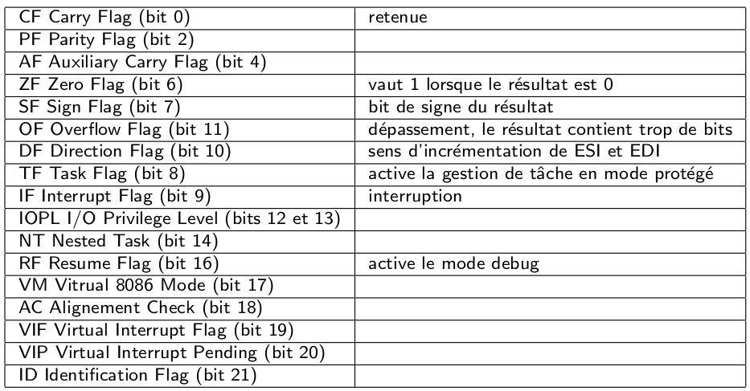
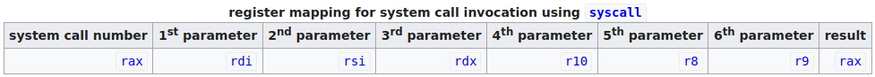
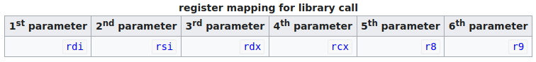
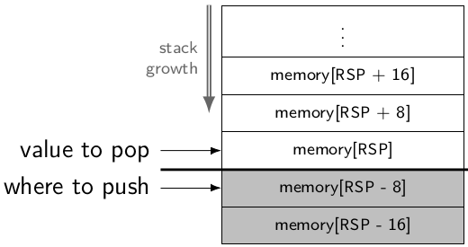

# Cheatsheet

```
;                     dst, src
label:    instruction operands        ; comment
```

| Size   |       |         |
| ------ | ----- | ------- |
| 64-bit | qword | 8 bytes |
| 32-bit | long  | 4 bytes |
| 16-bit | word  | 2 bytes |
| 8-bit  | byte  | 1 byte  |

## x86 register set

<p align="center">
  
</p>

Image source: [Program and Data Representation: Textbook](https://uva-cs.github.io/pdr/book/)

## GPR 64-bit naming conventions

|     | Name                        | Purpose                                                                       | Use                                       |
| --- | :-------------------------- | :---------------------------------------------------------------------------- | :---------------------------------------- |
| RAX | Accumulator register        | Accumulator for operands and results data                                     | Arithmetic operations                     |
| RCX | Counter register            | Counter for string and loop operations                                        | Shift/rotate instructions and loops       |
| RDX | Data register               | I/O pointer                                                                   | Arithmetic and I/O operations             |
| RBX | Base register               | Pointer to data in the DS segment                                             | Pointer to data                           |
| RSP | Stack Pointer register      | Stack pointer in the SS segment                                               | Pointer to the top of the stack           |
| RBP | Stack Base Pointer register | Stack pointer to data in the SS segment                                       | Pointer to the base of the stack          |
| RSI | Source Index register       | Pointer to data in the segment pointed to by the DS register                  | Source pointer for string operations      |
| RDI | Destination Index register  | Pointer to data (or destination) in the segment pointed to by the ES register | Destination pointer for string operations |

## RFLAGS

<p align="center">
  
</p>

Image source: Le langage assembleur intel 64 bits, Sovanna Tan

## System calls numbers

64-bit x86 system calls numbers:

```
/usr/include/x86_64-linux-gnu/asm/unistd_64.h
```

Other useful headers on Debian:

```
/usr/include/x86_64-linux-gnu/sys/syscall.h
/usr/include/x86_64-linux-gnu/asm/unistd.h
/usr/include/x86_64-linux-gnu/bits/syscall.h
```

MacOs: `osfmk/mach/i386/syscall_sw.h`

```
#define SYSCALL_CLASS_NONE  0   /* Invalid */
#define SYSCALL_CLASS_MACH  1   /* Mach */  
#define SYSCALL_CLASS_UNIX  2   /* Unix/BSD */
#define SYSCALL_CLASS_MDEP  3   /* Machine-dependent */
#define SYSCALL_CLASS_DIAG  4   /* Diagnostics */

#define SYSCALL_CONSTRUCT_UNIX(syscall_number) \
            ((SYSCALL_CLASS_UNIX << SYSCALL_CLASS_SHIFT) | \
             (SYSCALL_NUMBER_MASK & (syscall_number)))
```

## Calling conventions

<p align="center">
  
  
</p>

Images source: [Wikibooks: X86 Assembly/Interfacing with Linux](https://en.wikibooks.org/wiki/X86_Assembly/Interfacing_with_Linux)

## Errno

### Linux

Install `moreutils` package on Linux and run:
```
errno -l
```

> System calls are not required to return only positive or negative error codes. You need to read the source to be sure how it will return errors. Usually, it is the negative of a standard error code, for example, -EPERM.  The _syscall() macros will return the result r of the system call when r is nonnegative, but will return -1 and set the variable errno to -r when r is negative.  For the error codes, see errno(3).  [(Source)](_syscall(2) — Linux manual page)

`https://github.com/freebsd/freebsd/blob/master/sys/sys/errno.h`

```c
#if !defined(_KERNEL) && !defined(_STANDALONE)
#include <sys/cdefs.h>
__BEGIN_DECLS
int *	__error(void);
__END_DECLS
#define	errno		(* __error())
#endif
```

The [__errno_location](http://refspecs.linux-foundation.org/LSB_4.0.0/LSB-Core-generic/LSB-Core-generic/baselib---errno-location.html) function shall return the address of the errno variable for the current thread.

Steps:

- Reverse the sign of the error code to get the positive error code
- Moves function's return from rax to rdi to pass it to `__errno_location`
- Call `__errno_location`
- The return of `__errno_location` is the address of the errno variable
- Set its value with the error code

### MacOs

- A syscall return `errno` and sets the carry flag on error, instead of returning `-errno` in `rax`
- `rdx` register is clobbered by `syscall`
- MacOS being a BSD variant it is the carry flag that tells you if the syscall was wrong or not (errno is just an external linkage variable)

> Some BIOS calls may not be implemented on every machine, and are not guaranteed to work. Often an unimplemented interrupt will return either 0x86 or 0x80 in register AH. Just about every interrupt will set the carry flag (CF) on an error condition. This makes it easy to jump to an error handler with the jc conditional jump.  [(Source)](https://riptutorial.com/x86/example/23463/bios-calls)

## Push and pop

<p align="center">
  
</p>

Image source: [asm.pdf](https://markfloryan.github.io/pdr/slides/reiss/asm.pdf)

## Linked list structure

```c
typedef struct		s_list
{
	void		*data;
	struct s_list	*next;
}			t_list;
```

| Variable | Size    |                      |
| -------- | ------- | -------------------- |
| data     | 8 bytes | Pointer to data      |
| next     | 8 bytes | Pointer to next node |
