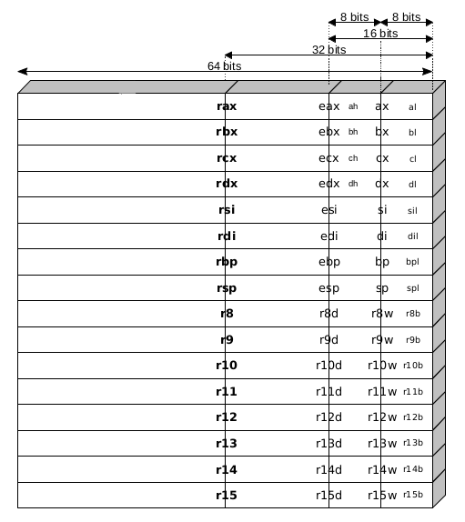

# Cheatsheet

```
;                     dst, src
label:    instruction operands        ; comment
```

| Size   |       |         |
| ------ | ----- | ------- |
| 64-bit | qword | 8 bytes |
| 32-bit | long  | 4 bytes |
| 16-bit | word  | 2 bytes |
| 8-bit  | byte  | 1 byte  |

## x86 register set

<p align="center">
  
</p>

Image source: [Program and Data Representation: Textbook](https://uva-cs.github.io/pdr/book/)

## GPR 64-bit naming conventions

|     | Name                        | Purpose                                                                       | Use                                       |
| --- | :-------------------------- | :---------------------------------------------------------------------------- | :---------------------------------------- |
| RAX | Accumulator register        | Accumulator for operands and results data                                     | Arithmetic operations                     |
| RCX | Counter register            | Counter for string and loop operations                                        | Shift/rotate instructions and loops       |
| RDX | Data register               | I/O pointer                                                                   | Arithmetic and I/O operations             |
| RBX | Base register               | Pointer to data in the DS segment                                             | Pointer to data                           |
| RSP | Stack Pointer register      | Stack pointer in the SS segment                                               | Pointer to the top of the stack           |
| RBP | Stack Base Pointer register | Stack pointer to data in the SS segment                                       | Pointer to the base of the stack          |
| RSI | Source Index register       | Pointer to data in the segment pointed to by the DS register                  | Source pointer for string operations      |
| RDI | Destination Index register  | Pointer to data (or destination) in the segment pointed to by the ES register | Destination pointer for string operations |

## System calls numbers

64-bit x86 system calls numbers:

```
/usr/include/x86_64-linux-gnu/asm/unistd_64.h
```

Other useful headers on Debian:

```
/usr/include/x86_64-linux-gnu/sys/syscall.h
/usr/include/x86_64-linux-gnu/asm/unistd.h
/usr/include/x86_64-linux-gnu/bits/syscall.h
```

## Calling conventions

<p align="center">
  
  
</p>

Images source: [Wikibooks: X86 Assembly/Interfacing with Linux](https://en.wikibooks.org/wiki/X86_Assembly/Interfacing_with_Linux)

## Errno

`https://github.com/freebsd/freebsd/blob/master/sys/sys/errno.h`

```c
#if !defined(_KERNEL) && !defined(_STANDALONE)
#include <sys/cdefs.h>
__BEGIN_DECLS
int *	__error(void);
__END_DECLS
#define	errno		(* __error())
#endif
```

- [__errno_location](http://refspecs.linux-foundation.org/LSB_4.0.0/LSB-Core-generic/LSB-Core-generic/baselib---errno-location.html)
- [How to change errno value in asm x64](https://stackoverflow.com/questions/62046052/how-to-change-errno-value-in-asm-x64)

## Push and pop

<p align="center">
  
</p>

Image source: [asm.pdf](https://markfloryan.github.io/pdr/slides/reiss/asm.pdf)
