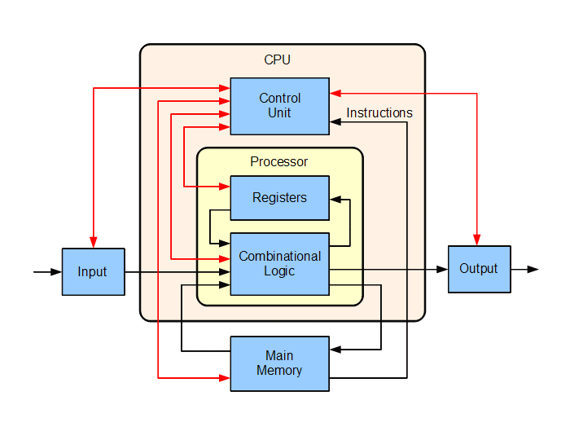

# CPU

<p align="center">
  
</p>

> Block diagram of a basic uniprocessor-CPU computer. Black lines indicate data flow, whereas red lines indicate control flow; arrows indicate flow directions.  [(Source)](https://en.wikipedia.org/wiki/Central_processing_unit#Structure_and_implementation)

A computer (ie CPU) essentially implements this process:

1. reads the [instruction pointer](http://www.simplecpu.com/InstructionPointer.html):  
   The instruction pointer register is a control register that holds the location of the next instruction in a pipeline, and increments itself after every instruction.
2. fetches the next instruction from a [storage device](https://datacadamia.com/computer/storage):  
   A machine instruction is a unique bit string that a device can identify and execute.
3. decode the instruction: A [decoder](https://datacadamia.com/computer/cpu/decode) retrieves the current instruction and selects the device to execute it.
4. execute it,
5. increments the instruction pointer
6. and then goes back to step one.

Source: [CPU - Pipeline (Cycle)](https://datacadamia.com/computer/cpu/pipeline)

## Storage

A storage device (or data-storage component or media) can be anything that can store and retrieve `0` and `1`. It stores byte:
- machine instructions byte,
- data byte.

They basically serve I/O request.

A data storage component is a computer components where data are recording (storing) such as:

- cpu registers and cache,
- ram,
- floppy disks,
- hard disks,
- CD-ROMs (optical discs).

Source: [Computer - Storage Device (Media)](https://datacadamia.com/computer/storage)

## Registers

Register is a hardware device component that is used for two purposes:

- storage of value (at high speed),
- passing argument and retrieving return value (to communicate between hardware devices).

Source: [Device - Register](https://datacadamia.com/computer/device/register)

Processor registers are located inside the processor. They are the quickest memory and are then located at the top of the memory hierarchy.  
One standard function of a register is to **define the input and output operand of an instruction**.

Source: [Processor - (Execution) Register](https://datacadamia.com/computer/cpu/register/register)

| Size   |       |         |
| ------ | ----- | ------- |
| 64-bit | qword | 8 bytes |
| 32-bit | long  | 4 bytes |
| 16-bit | word  | 2 bytes |
| 8-bit  | byte  | 1 byte  |

<p align="center">
  
</p>

Image source: [Program and Data Representation: Textbook](https://uva-cs.github.io/pdr/book/)

<p align="center">
  
</p>

The **8 General-Purpose Registers** are (16-bit naming conventions):

1. Accumulator register (AX). Used in arithmetic operations
2. Counter register (CX). Used in shift/rotate instructions and loops.
3. Data register (DX). Used in arithmetic operations and I/O operations.
4. Base register (BX). Used as a pointer to data (located in segment register DS, when in segmented mode).
5. Stack Pointer register (SP). Pointer to the top of the stack.
6. Stack Base Pointer register (BP). Used to point to the base of the stack.
7. Source Index register (SI). Used as a pointer to a source in stream operations.
8. Destination Index register (DI). Used as a pointer to a destination in stream operations.

The order in which they are listed here is for a reason: it is the same order that is used in a push-to-stack operation.

Source: [X86 Assembly/X86 Architecture](https://en.wikibooks.org/wiki/X86_Assembly/X86_Architecture)

[What does the 'R' in x64 register names stand for?](https://softwareengineering.stackexchange.com/questions/127668/what-does-the-r-in-x64-register-names-stand-for)

64-bit naming conventions:

|     | Name                        | Purpose                                                                       | Use                                       |
| --- | :-------------------------- | :---------------------------------------------------------------------------- | :---------------------------------------- |
| RAX | Accumulator register        | Accumulator for operands and results data                                     | Arithmetic operations                     |
| RCX | Counter register            | Counter for string and loop operations                                        | Shift/rotate instructions and loops       |
| RDX | Data register               | I/O pointer                                                                   | Arithmetic and I/O operations             |
| RBX | Base register               | Pointer to data in the DS segment. Preserved register: don't use it without saving it! | Pointer to data                           |
| RSP | Stack Pointer register      | Stack pointer in the SS segment                                               | Pointer to the top of the stack           |
| RBP | Stack Base Pointer register | Stack pointer to data in the SS segment                                       | Pointer to the base of the stack          |
| RSI | Source Index register       | Pointer to data in the segment pointed to by the DS register                  | Source pointer for string operations      |
| RDI | Destination Index register  | Pointer to data (or destination) in the segment pointed to by the ES register | Destination pointer for string operations |

# Memory Layout

```
High Addresses ---> .----------------------.
                    |      Environment     |
                    |----------------------|
                    |                      |   Functions and variable are declared
                    |         STACK        |   on the stack.
base pointer ->     | - - - - - - - - - - -|
                    |           |          |
                    |           v          |
                    :                      :
                    .                      .   The stack grows down into unused space
                    .         Empty        .   while the heap grows up. 
                    .                      .
                    .                      .   (other memory maps do occur here, such 
                    .                      .    as dynamic libraries, and different memory
                    :                      :    allocate)
                    |           ^          |
                    |           |          |
 brk point ->       | - - - - - - - - - - -|   Dynamic memory is declared on the heap
                    |          HEAP        |
                    |                      |
                    |----------------------|
                    |          BSS         |   Uninitialized data (BSS)
                    |----------------------|   
                    |          Data        |   Initialized data (DS)
                    |----------------------|
                    |          Text        |   Binary code
Low Addresses ----> '----------------------'
```

Source: [Memory Layout of C program](https://aticleworld.com/memory-layout-of-c-program/)

Stack:

- Stores local variables
- When a function is called, a stack frame is created
- When a function returns, a stack frame is destroyed
- One function = one stack frame
- Stack frames contain functions's local variables, arguments and return values

Heap:

- Dynamically allocated memory (malloc, calloc, realloc)
- Used to allocate memory at run time
- Shared by all shared libraries and dynamically loaded modules in a process

BSS (Block Started by Symbol) / Uninitialized data segment:

- All uninitialized global and static variables, or initialized to zero

Data (Initialized data segment):

- Global and static variable initialized with non-zero values 

Text / Code segment:

- Executable instructions of C programs
- Machine language representation of steps of the program
- Sharable and read-ony

> The code segment in memory is typically read-only and has a fixed size, so on embedded systems it can usually be placed in read-only memory (ROM), without the need for loading. If the code segment is not read-only, then the particular architecture allows self-modifying code. Fixed-position or position independent code may be shared in memory by several processes in segmented or paged memory systems. As a memory region, the code segment may be placed below the heap or stack in order to prevent heap and stack overflows from overwriting it.  [(Source)](https://en.wikipedia.org/wiki/Code_segment)
